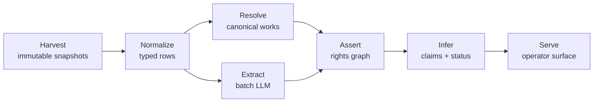

# Colophon v1 — Build PRD

2026-09-17 · @Someone

## Purpose

This is the build spec for Colophon v1, written to be executed by Claude Code in a fresh repository. The seven CO·DISC discovery deliverables remain the source of truth; this document turns them into schemas, module boundaries, build order, and tests.

Done means: fifty books the operator could plausibly acquire, each with a computed rights status, a visible evidence chain, and a named counterparty to call. Every requirement below exists to make that list true.

| Deliverable | Governs | Written up in |
| --- | --- | --- |
| I Product Requirements | Scope, users, success measures | Scope · Acceptance criteria |
| II Rights-Availability Logic | Status model, all channel date math | Channel engine |
| III Data Source & Access | Source register, what each source proves | Data layer |
| IV Technical Architecture | Pipeline stages, stack, provenance contract | System shape |
| V Prioritized Roadmap | Build order and milestones | Build sequence |
| VI Risk & Compliance | Constraints built as features | Compliance surfaces |
| VII Ownership Inference | Evidence tiers, rules, claim record | Ownership inference |

Where this spec and a deliverable disagree, the deliverable wins and this spec is wrong — flag it rather than coding around it.

## Scope and non-goals

V1 covers United States trade children's books — picture books and middle grade — published 1960 to 1998, seeded with roughly 5,000 titles weighted toward the 1968–1992 grant band. Single tenant, single operator, no public endpoints.

In scope for v1:

- All three reversion channels computed per work, per right type, per territory
- Tiered ownership claims with the evidence visible behind each one
- Adaptability ranking calibrated against a hand-scored set of 250 titles
- A window calendar keyed to notice deadlines, option anniversaries, and public-domain entry
- An outreach record with stage tracking and evidence-packet export

Out of scope, from Deliverable I:

- Notice drafting, service, or recordation — that belongs to a rightsholder's own counsel
- Non-US territories and non-US originated works, other than flagging where territory is unsettled
- Young adult, graphic novels, licensed-character and packaged series titles, which are largely work made for hire and fail the first filter anyway
- Any subscriber-facing product until the corpus is proven against real outcomes

Four prohibitions from Deliverable IV are architectural, not preferences. No notice generator or filing-ready document assembly. No auto-crawler against gated trade sources — licensed feeds or manual capture only. No model-written status: extraction proposes, deterministic rules dispose. No multi-tenant layer in v1; adding it later costs a week, carrying it early distorts every schema decision.

## Domain model

The unit of computation is the triple `(work, right_type, territory)`, not the book. One book carries several grants: text and illustrations sit in separate chains, and publishing rights and dramatic rights are usually separate grants with separate clocks. Every module uses these nouns with these meanings.

| Term | Meaning in code | Notes |
| --- | --- | --- |
| `work` | Canonical children's book, one row, one verified `original_publication_date` | Every clock in the channel engine hangs off this date |
| `edition` | A printing, reissue, board-book variant, or foreign edition | Clusters into exactly one work |
| `party` | Person or organization: author, illustrator, heir, agent, publisher, studio | Survives imprint changes, studio renames, agency mergers |
| `grant` | An asserted transfer of a right from a party to a party | Graph edge, with execution and effective dates |
| `right_type` | `publication`, `dramatic`, `audio`, `merchandise`, `other` | v1 computes and ranks on `dramatic`; others are carried, not scored |
| `territory` | ISO code or `US`, `WORLD`, `UNSETTLED` | Modelled as a flagged variable, never a settled value — see Open questions |
| `status` | One of eight enum values, per triple | Defined in Channel engine |
| `claim` | A scored, contestable assertion about who holds a right | Schema in Ownership inference |
| `evidence` | Source id, URL, capture date, citation span | No span, no record |
| `tier` | 1 document-verified … 4 estimated | Both a data-quality label and an operating budget |

Two rules follow from the model and hold everywhere. A status without an evidence set is not a status, and the interface must show the difference. A work whose text and art resolve to different statuses is a split result and scores as a downgrade, not a partial win — the film asset is usually the look.

## System shape and repo layout

Six stages, each replayable against the bytes it came from. Nothing is parsed in place, nothing is overwritten, and superseded assertions are retained rather than deleted.



Extraction feeds the graph. It never writes status, and it never emits a claim — it supplies typed events with citation spans that the deterministic rules operate on.

| Layer | Choice | Rationale |
| --- | --- | --- |
| Ingest | Python, scheduled jobs | Sources are bulk files and periodic APIs; no streaming, no queue broker |
| Raw store | Object storage, versioned | Cheap, immutable, the audit trail business affairs expects |
| Database | Postgres + pgvector | Relational graph plus vectors for title and name matching; one system until it genuinely breaks |
| Extraction | Batch LLM, structured output | Returns a citation span or the extraction is discarded |
| Rules | Plain versioned code | Date math must be deterministic, testable, explainable line by line |
| Surface | PWA | Works on a phone at a book fair, no app-store dependency |

```
colophon/
  harvest/        one module per source, writes snapshots only
  normalize/      snapshot -> typed rows, original ids preserved
  resolve/        edition clustering, canonical work + confidence
  graph/          rights graph: edges, parties, evidence sets
  channels/       §203, §304, contractual, option-lapse — pure functions
  inference/      evidence taxonomy, rules R1-R5, claim construction
  extraction/     batch prompts, typed events, span enforcement
  scoring/        adaptability model + calibration harness
  api/            single-tenant service for the surface
  web/            PWA: queue, work view, calendar, outreach
  compliance/     source-terms register, disclosure text, retention jobs
  tests/          channel fixtures, worked examples, audit sampling
```

`channels/` must have no I/O and no database access. It takes a work plus its graph edges and returns statuses with dates, so the whole statutory core is unit-testable without a fixture database.

## Data layer

Everything free and bulk-downloadable is harvested first; paid sources enter only when a specific tier promotion depends on them. A harvester cannot be written until its source's licence terms are recorded in the source register — that check is a test, not a convention.

| Source | Feeds | Strongest tier alone | Access | v1 |
| --- | --- | --- | --- | --- |
| Copyright recordations | Recorded transfers, who held what as of a date | T1 | Bulk + JSON API | Yes |
| Recorded termination notices | A termination under way, by whom, effective when | T1 | Bulk + JSON API | Yes |
| Registration records | Author, claimant, publication date, WFH flag | T2 | Bulk | Yes |
| Renewal records pre-1964 | Whether renewed; unrenewed means public domain | T1 | Bulk + Stanford set | Yes |
| Library of Congress MARC | First-edition records, LCCN join key, illustrator credit | — | Free | Yes |
| Open Library | Edition-to-work clustering, ISBN, subjects, covers | — | Free, open licence | Yes |
| Award lists | Caldecott, Newbery, Coretta Scott King, Sibert, state lists | — | Free, hand-curated once | Yes |
| Publisher rights guides | Rights stated as available, by title | T2 | Free PDFs | Yes |
| Screen metadata | An adaptation exists, by whom, released when | T2 | API, attribution | Yes |
| Wikidata | Book-to-screen relations as triples | T3 | SPARQL | Yes |
| Catalog of Copyright Entries | Pre-1978 registration and renewal detail | T2 | Scan + OCR | Month 2 |
| Trade announcements | An option or purchase was made, by whom, when | T3 | Licensed feeds | Month 2 |
| Deal-report services | Named agents on both sides of a deal | T3 | Subscription | Deferred |
| ISBN registry | Imprint lineage, in-print status, format variants | — | Paid | Deferred |

Recordation is voluntary, so absence proves nothing — except for termination notices, where recordation before the effective date is mandatory and absence is therefore meaningful. Encode that asymmetry explicitly; it is the one place a null is evidence.

Person and estate research stays inside public records: death and survivorship indexes, probate filings pulled only for shortlisted targets, agency and estate listings, and the trademark register. No purchased personal data, no contact aggregation, no household or relative graphs.

Raw store contract: one prefix per source, one object per fetch, named by source id and capture timestamp, never mutated. Normalization reads snapshots and writes typed rows — registrations, recordations, editions, screen titles, announcements, persons, organizations — preserving original identifiers alongside internal ones.

No public source contains the publishing agreement. Nothing external shows whether dramatic rights were carved out or what the reversion clause requires, so the honest output is a ranked lead with evidence attached and the next confirming step named.

## Canonical work resolution

This layer's only job is a single trustworthy `original_publication_date` per work, because every clock in the channel engine hangs off it. Target: at least 95% of seed titles resolved to a canonical work with a verified date.

Resolution order, each step recorded on the work so a bad cluster can be traced:

1. Exact joins on LCCN, then ISBN-13 and ISBN-10 across editions
2. Open Library work clustering, corrected for board-book and reissue variants that it merges or splits wrongly
3. Fuzzy title-plus-author matching over pgvector embeddings, with an illustrator tiebreak when two clusters share a title and author
4. Earliest credible edition wins the publication date; Library of Congress MARC outranks Open Library on conflict

Each work carries a `resolution_confidence` score and the evidence for its date. Works below threshold go to a review list rather than into scoring — a wrong publication date produces a confidently wrong statutory window, which is the most expensive error in the system.

Two filters run here, before anything reaches scoring. Registrations flagged work made for hire are marked `EXCLUDED·WFH` for that contribution. Works whose term has expired, or whose pre-1964 registration was never renewed, are marked `PUBLIC·DOMAIN` and routed to the public-domain sweep. Anything secured before roughly 1963 has run both § 304 clocks and goes straight to the public-domain test.

## Channel engine

Pure functions over a work and its graph edges, returning exactly one status per triple with its dates, tier, and evidence set. No model touches a statutory computation.

| Status | Meaning | Operator action |
| --- | --- | --- |
| `EXCLUDED·WFH` | Work made for hire; no termination right exists, ever | Drop from statutory scoring |
| `PUBLIC·DOMAIN` | Term expired or renewal not made | No acquisition needed |
| `NEVER·GRANTED` | No evidence the right ever left the author | Approach directly |
| `REVERTED·LIKELY` | Out-of-print or lapsed-option signals | Confirm, then approach |
| `TERMINABLE·NOW` | Window open, notice can still be served in time | Work the calendar |
| `TERMINABLE·FUTURE` | Window computed, notice service opens on a date | Build the relationship |
| `LAPSED·WINDOW` | Window passed or notice deadline missed | Statutory route closed; test Channel A |
| `GRANTED·ACTIVE` | Held and exploited | Monitor only |

### Channel C — statutory termination

```
§ 203  grants executed by the author on or after 1978-01-01

window_start = if grant conveys right of publication:
                 min(publication_date + 35y, execution_date + 40y)
               else execution_date + 35y
window_end   = window_start + 5y
notice_service = effective_date - 10y … effective_date - 2y
last_serviceable_date = window_end - 2y      <- the real deadline

§ 304(c)  window = copyright_secured + 56y … +61y
§ 304(d)  only if the 304(c) window expired before 1998-10-27
          and was not exercised → secured + 75y … +80y
```

Surface `last_serviceable_date` as the primary date everywhere and the window as context. Most book publishing agreements convey the right of publication, so the dual-clock branch governs the majority of the corpus.

Holder logic the engine must model: the author, or if deceased a surviving spouse taking half with children and grandchildren taking half per stirpes, with more than half the termination interest required to terminate. For a joint work, a majority of the authors who executed the grant — so a picture book signed jointly by author and illustrator needs both when there are two. Grants executed by heirs rather than by the author fall outside § 203 entirely and must return no § 203 window at all.

A derivative work prepared under the grant before termination may keep being exploited, but no new derivative works may be prepared under the terminated grant. Books adapted once decades ago therefore score higher, not lower — the recaptured rights support a new adaptation while the old film runs in the background.

### Channel A — contractual reversion

| Clause archetype | Observable signal | Tier |
| --- | --- | --- |
| Out of print | No edition in print, no ebook or audio, no reprint recorded in several years | T3 |
| Availability / sales floor | Prolonged absence from trade channels; royalty thresholds are invisible externally | T4 |
| Non-exploitation of subrights | Dramatic rights granted to the publisher, never licensed onward | T3 |
| Imprint dissolution | Publisher defunct or absorbed, catalog partially abandoned | T3 |

Reversion under these clauses is request-activated, not automatic. The finding is "this author could likely get these rights back by asking" — the UI must phrase it that way, because it is a conversation, not a claim.

### Channel B — option lapse

```
years_since_announcement >= 5
  and no production credit
  and no renewal announcement
  and no development trace
    → REVERTED·LIKELY  (T3; promotes to T2 on author or agent confirmation)
```

Run all channels on every work and never let one channel's result suppress another. Worked example A in Deliverable II is exactly this: a book whose § 203 route is permanently closed while Channel A remains fully open, which a single-channel product would discard wrongly.

## Ownership inference

The target is not certainty but a contestable claim: a named holder, a right type, a territory, an as-of date, a tier, the evidence behind it, and the single cheapest action that would raise or refute it.

| Evidence | Establishes | Tier |
| --- | --- | --- |
| Recorded transfer | Named party held a specified right as of a date | T1 |
| Recorded termination notice | Who is terminating what, effective when | T1 |
| Contract in hand | Everything; arrives from a counterparty, never from research | T1 |
| Registration claimant ≠ author | A transfer occurred at registration; scope unknown | T2 |
| WFH flag on registration | No termination right in that contribution; filters before it scores | T2 |
| Screen credit | Rights were exercised, by whom, when | T2 |
| Rights guide listing | Publisher states what it controls and what is available | T2 |
| Probate record | Successors in interest for a deceased author or illustrator | T2 |
| Deal announcement | An option or purchase was reported; unreliable on scope and duration | T3 |
| Agency or estate listing | Who handles dramatic rights today | T3 |
| Character trademark filing | Who believes they own the brand | T3 |
| Absence signals | No adaptation, no grant, long out of print | T4 |

```
R1  recorded transfer + no later transfer or termination
      → held_by = recorded party                              T1
R2  deal announcement + screen credit within 6y
      → held_by = producer, adaptation exists                  T2
R3  deal announcement + no credit + >=5y elapsed + no renewal
      → REVERTED·LIKELY, holder = author or estate             T3
R4  no recorded grant + no adaptation + no deal trace
      + author living or estate identified
      → NEVER·GRANTED·LIKELY                                   T4
R5  any two rules conflict → contradiction queue, no status emitted
```

R4 is the product's best output and its hardest finding to trust: a book nobody ever optioned, whose author or estate still holds everything, needing no statute and no incumbent negotiation. It carries the lowest tier and the most explicit confirmation path, and the UI must not let its cheapness read as confidence.

```
claim {
  work_id · right_type · territory · as_of
  asserted_holder    party_id | "author or estate" | unknown
  tier               1-4
  rule_fired         R1…R5 · rule_version
  evidence[]         source · url · capture_date · span
  contradicts[]      competing claim ids
  confirming_action  the one next step that would settle it
  confidence_decay   tier degrades as as_of ages
}
```

`confirming_action` turns every uncertain record into a task rather than a shrug. `confidence_decay` encodes that a 2009 deal announcement is weaker evidence in 2026 than it was in 2011 — implement it as a scheduled recompute, not a display-time adjustment, so the queue reorders itself as claims age.

Extraction runs in five steps: candidate retrieval by title, author, and character name; a batch model pass returning typed events with a verbatim citation span; entity linkage resolving parties across imprint changes, studio renames, agency mergers, and estate successions; deterministic rule evaluation producing claims; and a review queue for contradictions, high-value targets, and every proposed promotion to tier 1. Review decisions are stored as evidence in their own right.

Promotion costs are the operating budget. T4 to T3 is a targeted records search — hours, free. T3 to T2 is an agent, estate, or publisher permissions desk confirming who controls dramatic rights — days, a phone call. T2 to T1 is a certified Copyright Office search or the counterparty producing the agreement — weeks and fees, spent only on targets already in conversation. The UI should show the next rung and its cost, not just the current tier.

## Adaptability scoring

Ranking is calibrated against 250 titles hand-scored by the operator before any model is fitted. That labelled set is the asset no dataset contains, and it is built in Phase 0 — the scoring module ships against it or not at all.

Inputs to the score, all traceable to a stored fact:

- Demand evidence: awards, long-run in-print history, library and canon-list presence, subject tags with screen precedent
- Prior validation: a lapsed option is the strongest single signal in the system, because somebody with money already did the diligence
- Rights cleanliness: single chain beats split chain; text-only recapture is a partial asset and scores as one
- Counterparty reachability: a named agent, estate, or living author present in the graph
- Clock position: how far the work is from its `last_serviceable_date`, favouring lead time over urgency

The ranked queue replaces the flat status board only once precision on availability calls holds. Ranking a wrong status is worse than not ranking at all, so the board ships first and the queue second.

Seed the corpus deliberately against the known bias: award lists skew toward canonized titles, so under-adapted and historically overlooked catalogs go in alongside them, and the scoring harness reports rank distribution across those cohorts.

## Operator surface

Every screen answers one question: what do I do next with this book. Single tenant, no public endpoints, PWA so it works on a phone at a book fair.

| Screen | The question it answers | Must show |
| --- | --- | --- |
| Queue | Which book do I work today | Rank, status, tier, counterparty, next confirming action |
| Work view | Why does the system believe this | Every claim traceable to its source in one click |
| Window calendar | What has a date attached | `last_serviceable_date` first, window as context; alerts before the actionable date |
| Outreach | Who have I talked to and what did they say | Contact records, stage, conversation log |
| Contradiction queue | What does the system not know | R5 conflicts, tier-1 promotions, high-value targets awaiting review |

The evidence viewer is the feature that makes the tool usable in a conversation with a lawyer, so build it before ranking, not after. One click from any assertion to the source document, the citation span, and the capture date.

Evidence packet export produces one clean document per target for counsel or a producer: statuses with their dates and rule versions, claims with their tiers, every evidence item with source and capture date, and a plain label saying this is research and may be wrong. It is not a filing and must not look like one.

Calendar alerts fire before the actionable date, never on it. For a statutory target the alert is keyed to the notice window opening and to `last_serviceable_date` minus a configurable lead, because the whole point of the channel is that it can be planned years ahead.

## Compliance built as features

Colophon discovers that an author can get their rights back, and Colophon may want to buy those rights. Those two facts cannot sit inside the same conversation, and the separation has to live in code rather than in a policy document.

- **Counsel referral at first contact.** Any outreach template addressed to a rightsholder carries written independent-counsel language, generated by the system and not editable out of the record. The product never tells an author whether to terminate.
- **No filings.** No notice generator, no document assembly intended for filing, no personalized recommendation. Generalized calculation and public-record research sit on the safe side of the unauthorized-practice line; applying law to a particular person's circumstances does not.
- **No assertion of clear title.** Every export is labelled research, carries tiers and dates, and is wrong sometimes by design — survivable only if the labelling is honest.
- **Source-terms register.** Licence terms live in the schema next to each source: non-commercial restrictions, attribution, per-seat limits, anti-scraping clauses. Harvesters read the register at run time and refuse to run against a source with no terms recorded.
- **Retention.** Personal records are stored for shortlisted targets only, with a deletion path that runs when a target is closed out.

Dealmaking constraints that the pipeline model must respect: termination rights cannot be bought, waived, or pre-assigned, so no feature may imply a right can be optioned before its effective date. Before that date the pipeline models relationship stages, not contract stages. A target under notice is scored as contested with the incumbent named, since the original grantee may negotiate when nobody else can. And any recorded new grant to an incumbent during a live window raises an alert — a re-signed deal can replace the old grant and extinguish the termination.

Channels A and B carry none of these constraints. Once rights are back with the author, a deal is a normal deal, which is a further reason the non-statutory channels lead the roadmap.

## Acceptance criteria and tests

| Measure | Target | Test |
| --- | --- | --- |
| Corpus resolution | ≥ 95% | Share of seed titles resolved to a canonical work with a verified original publication date |
| Channel precision | ≥ 90% | Availability calls surviving manual audit on a 100-title random sample |
| Claim coverage | ≥ 60% | Share of corpus with a rights claim at tier 3 or better |
| Qualified targets | 50 | Available or soon-available position, reachable counterparty, real adaptation case |
| First conversation | 1 | A live discussion on a property the system surfaced and the operator did not already know |

Precision is favoured over recall throughout. A false positive costs an outreach cycle, which is the scarce resource in a single-operator pipeline.

The three worked examples in Deliverable II ship as the first channel-engine fixtures:

1. Grant April 1986, published September 1987, publication right conveyed → window 2022-09 to 2027-09, last serviceable 2025-09, status `LAPSED·WINDOW`, and Channel A still open on the same work
2. Grant June 1991, published March 1992 → window 2027-03 to 2032-03, notice servable now for effective dates from 2028, status `TERMINABLE·FUTURE`
3. Author and illustrator signing separate 1989 agreements → split result, text `TERMINABLE·FUTURE`, art `EXCLUDED·WFH` pending document review, scored as a downgrade

Further required tests: a § 304(d) case that correctly returns no second window because the 304(c) window was exercised; a grant executed by heirs returning no § 203 window at all; a joint work requiring both signatories; and a replay test proving that a corrected rule produces new assertions superseding the old ones rather than rewriting history, with a reviewable diff.

The manual audit is a standing job, not a one-off. Sample 100 titles per full corpus pass, record the operator's verdict against the computed status, and store those verdicts as evidence so the audit set grows into a regression suite.

## Build sequence

Every phase ends with a list the operator could act on that week. A half-built pipeline producing twenty real names beats a complete one producing none.

| Phase | Build | Ends with |
| --- | --- | --- |
| Phase 0, weeks 1–4 | Corpus boundary, \~5,000 seed titles, 250 hand-scored calibration titles, channel rules fixed and unit-tested, twenty books researched end to end by hand | Twenty books with status, evidence set, and a named counterparty — plus the list of every tedious step, which becomes the build backlog |
| Month 01 | Harvesters for registration, recordation, renewal; bibliographic ingest; immutable raw store; canonical resolution; deterministic channel engine; WFH and public-domain filters first; flat status board | Status computed for 5,000 works on real data, 100-title audit at ≥ 90% precision |
| Month 02 | Ownership inference per VII; batch extraction with citation spans; evidence viewer; adaptability scoring against the seed set; ranked queue; window calendar with alerts | Fifty qualified targets, each at tier 3 or better with a reachable counterparty |
| Month 03 | Outreach pipeline with stage tracking and conversation log; evidence packet export; public-domain sweep as a standing feed; contradiction and promotion workflow; compliance surfaces | Production v1: pipeline runs end to end and one live conversation is under way |

Phase 0 is not preparation for the build; it is the specification the software is written against. Do not start Month 01 before twenty books have been worked by hand.

Budget three to five complete reprocessing passes over the corpus in the first quarter, not one. Extraction logic will change several times and each change implies a full re-run — cost scales with documents processed, not users active.

After v1, in order: corpus expansion; the consumer read-then-watch surface running on the same adaptation graph; the intel subscription, which follows the first acquisitions rather than preceding them because it arms competitors; and the author-side service, gated on the conflict architecture in VI.

The ordering rule that settles disputes: nothing that serves a future customer gets built before something that finds a real book this month.

## Open questions

These are decisions for the operator and counsel, not for the build. Each one changes a schema or a screen, so record the answer in the repo when it lands.

- [ ] Business posture — intel product, principal acquirer, or both. Decides whether entity separation is designed in now or retrofitted later.
- [ ] Territory — a recapture reaching worldwide rights was affirmed in one circuit and is under Supreme Court petition. Until it resolves, territory stays a flagged variable and no deal is priced on the assumption.
- [ ] Illustrator work-made-for-hire recitals — whether a supplementary-work recital holds, and what evidence would settle it short of the contract. Governs how much of the picture-book corpus is scorable at all.
- [ ] What a third party may and may not do before a termination's effective date — shapes the entire outreach stage model.
- [ ] Paid-source triggers — the specific tier promotion that justifies the first subscription, and which of trade announcements or deal reports comes first.
- [ ] Alert lead times — how far ahead of `last_serviceable_date` and window opening the calendar should fire.
